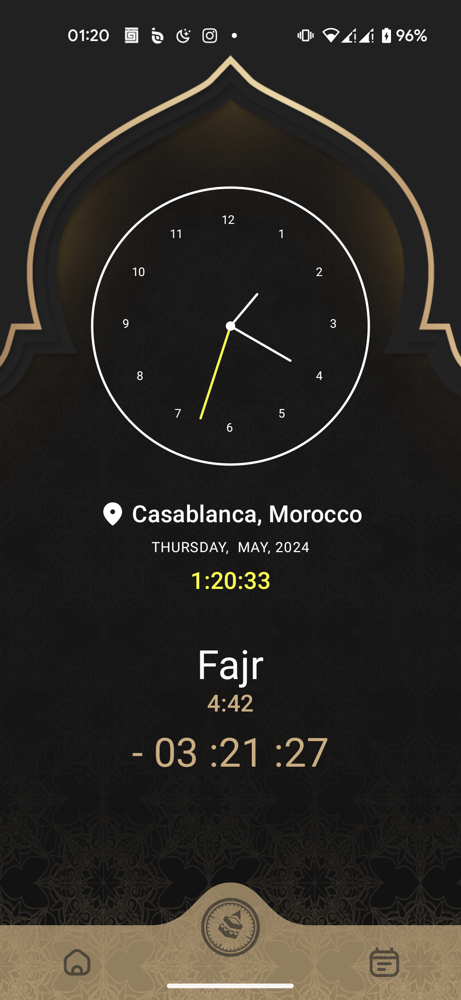
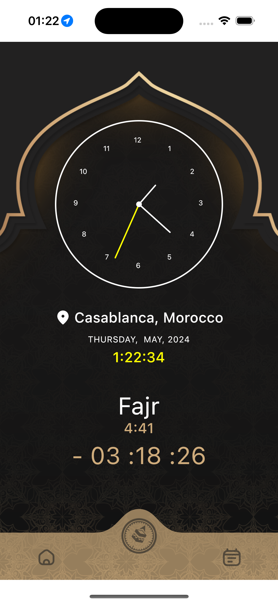

# JtSalat

___
**JtSalat** is a _Kotlin Multiplatform_ and _Compose Multiplatform_ project targeting Android, iOS to calculate prayers
times based on your current location.

**NB: This app doesn't call any web serves**

### Screenshots




### Demo Video

[jtsalat_demo.mov](artwork/jtsalat_demo.mp4)

### TODO

- [x] Home Screen
- [x] Compass and Qibla Screen
- [x] Calender Screen
- [ ] Calender : get prayers time for selected day on calender
- [ ] Settings Screen
- [ ] Alarm and Notifications for current prayer
- [ ] Deploy to Play Store and Apple Store

### Used Libraries

- [Jetbrains compose navigation](https://www.jetbrains.com/help/kotlin-multiplatform-dev/compose-navigation-routing.html)
- [KMM Calender](https://github.com/WojciechOsak/Calendar)
- [moko-geo](https://github.com/icerockdev/moko-geo)
- [adhan-kotlin](https://github.com/batoulapps/adhan-kotlin)
- [multiplatform-settings](https://github.com/russhwolf/multiplatform-settings)

* `/composeApp` is for code that will be shared across your Compose Multiplatform applications.
  It contains several subfolders:
  - `commonMain` is for code that’s common for all targets.˚
  - Other folders are for Kotlin code that will be compiled for only the platform indicated in the folder name.
    For example, if you want to use Apple’s CoreCrypto for the iOS part of your Kotlin app,
    `iosMain` would be the right folder for such calls.

* `/iosApp` contains iOS applications. Even if you’re sharing your UI with Compose Multiplatform,
  you need this entry point for your iOS app. This is also where you should add SwiftUI code for your project.


Learn more about [Kotlin Multiplatform](https://www.jetbrains.com/help/kotlin-multiplatform-dev/get-started.html)…

Build with ❤

```
Copyright [2024] [ABDELMAJID ID ALI]

Licensed under the Apache License, Version 2.0 (the "License");
you may not use this file except in compliance with the License.
You may obtain a copy of the License at

    http://www.apache.org/licenses/LICENSE-2.0

Unless required by applicable law or agreed to in writing, software
distributed under the License is distributed on an "AS IS" BASIS,
WITHOUT WARRANTIES OR CONDITIONS OF ANY KIND, either express or implied.
See the License for the specific language governing permissions and
limitations under the License.
```